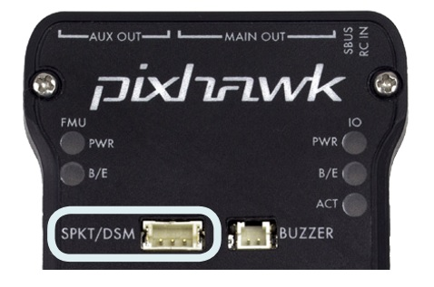
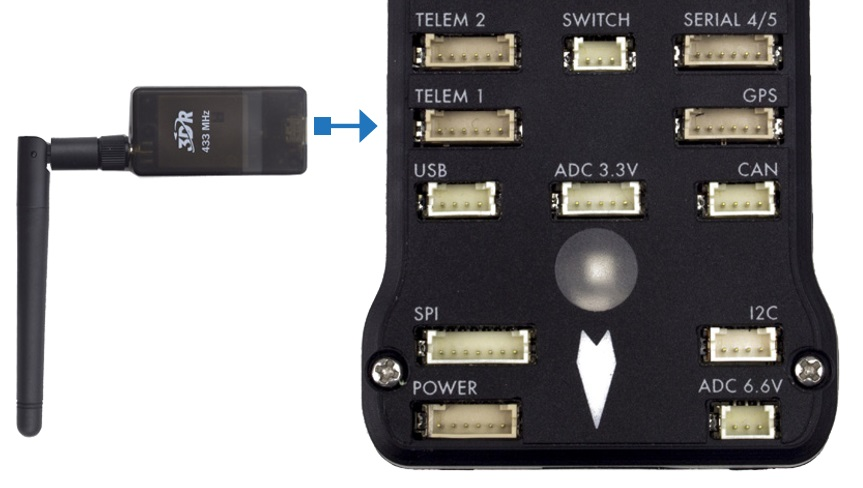

# Pixhawk Wiring Quick Start

This quick start guide shows how power the 3DR Pixhawk flight controller and connect its most important peripherals
(including output connections for copter, plane, and VTOL vehicles).
  
 

## About Pixhawk

The *3DR Pixhawk* is a well regarded flight controller based on the [Pixhawk Project's](https://pixhawk.org/) FMUv2 architecture. 

* [Pixhawk Series](../flight_controller/pixhawk_series.md)
* [3DR Pixhawk](https://dev.px4.io/hardware-pixhawk.html) (PX4 DevGuide)

> **Note** The Pixhawk is no longer available from 3DR. Other flight controllers based on the Pixhawk FMUv2 architecture are available from other companies (these share the same connections, outputs, functions, etc. and are wired in a similar way).

## Wiring Chart Overview

The image below shows standard Pixhawk connections (excepting the motor and servo outputs). We'll go through each main part in the following sections.

 
> **Note** More detailed wiring information is shown in this [QuadCopter Pixhawk Wiring Infographic](../../images/../../images/pixhawk_infographic2.jpg).

## Mount and Orient Controller

The *Pixhawk* should be mounted on the frame using vibration-damping foam pads (included in the kit). It should be
positioned as close to your vehicle’s center of gravity as possible, oriented top-side up 
with the arrow points towards the front of the vehicle.

> **Note** If the controller cannot be mounted in the
  recommended/default orientation (e.g. due to space constraints) you will
  need to configure the autopilot software with the orientation that you
  actually used: [Flight Controller Orientation](../config/flight_controller_orientation.md).

## Buzzer and Safety Switch

Connect the included buzzer and safety switch as shown below (these are mandatory).

## GPS + Compass

Attach a GPS (required) to the GPS port using the 6-wire cable supplied in the kit. Optionally attach a compass to the I2C port using a 4-wire cable (the Pixhawk has an internal compass, than can be used if necessary).

> **Note** The diagram shows a combined GPS and Compass.  The GPS/Compass should be mounted on the frame as far away from other electronics as possible, with the direction marker towards the front of the vehicle (separating the compass from other electronics will reduce interference).

## Power

Connect the output of a *Power module* (PM) to the **POWER** port using a 6-wire cable as shown. The PM input will be connected to your LiPo batter, while the main output will supply vehicle ESCs/motors (possibly via a power distribution board).

The power module supplies the flight controller with power from the battery and also sends information about the analog current and voltage supplied via the module (including both power to the flight controller and to motors etc). 

> **Warning** The power module supplies the flight controller itself, but cannot power servos and other hardware connected to the controller's output ports (rail). For copter this does not matter because the motors are separately powered. 

For planes and VTOL the output rail will need to be separately powered in order to drive servos for rudders, elevons etc. Often the main pusher/puller motor uses an ESC with an integrated [BEC](https://en.wikipedia.org/wiki/Battery_eliminator_circuit) that can be connected to the AUX5 pin to power the Pixhawk output rail. If not, you will need to setup a 5V BEC to connect to one of the free Pixhawk ports (without power, the servos will not work).

<!-- It would be good to have real example of this powering --> 

## Radio Control

A radio transmitter can be used to control movement, set the [flight mode](../flying/flight_mode_selection.md), and otherwise communicate with the vehicle. The transmitter sends messages to a radio receiver on the vehicle that is connected to the flight controller.

You will need to select a compatible transmitter/receiver combination and then *bind* them so that they communicate (read the instructions that come with your specific transmitter/receiver). 

> **Note** Conveniently, compatible systems are often sold together. For example, this [Taranis X9D and FrSky X8R](https://hobbyking.com/en_us/frsky-2-4ghz-accst-taranis-x9d-plus-and-x8r-combo-digital-telemetry-radio-system-mode-2.html?___store=en_us) is a popular combination.

### Receivers

Pixhawk supports many different radio receiver models. *PX4* and *Pixhawk* have been validated with:

- All Spektrum DSM RC receivers
- All Futaba S.BUS and S.BUS2 RC receivers
- All FrSky PPM and S.Bus models
- Graupner HoTT
- All PPM models from other manufacturers

The appropriate connection for each type of receiver is described below:

- PPM and S.BUS receivers must connect to the **RC** ground, power and signal pins as shown.
  
- PWM receivers must connect to the RCIN channel *via* a PPM encoder 
  [like this one](http://www.getfpv.com/radios/radio-accessories/holybro-ppm-encoder-module.html) (PPM receivers use a single signal wire for all channels, while PWM receivers have an individual wire for each channe).
- Spektrum and DSM receivers must connect to the **SPKT/DSM** input.
  

### Transmitters

One of the most popular radio systems is the open source *FrSky Taranis PPM-Sum Compatible Transmitter*. This is compatible with many high quality FrSky PPM-Sum compatible receivers.

Other popular transmitter/receiver combinations include:

* Turnigy transmitters (with the FrSky Transmitter Module) and compatible PPM-Sum receivers.
* Futaba Transmitters and compatible Futaba S-Bus receivers.

## Telemetry Radios (Optional)

Telemetry radios may be used to communicate and control a vehicle in flight from a ground station (for example, you can direct the UAV to a particular position, or upload a new mission). One radio must be connected to your vehicle as shown below. The other is connected to your ground station computer or mobile device (usually by USB).

<!-- what configuration is required once you've set up a radio) -->

## Motor/Actuator Outputs 

### Copter

There is a 1:1 mapping between pin-out and motor. The actual number of motors and how they are wired up depends on the type of multicopter. For more information see the [Copter Motor Map](../assembly/copter_motor_map.md).

Output | Connection
--- | ---
MAIN 1   | Motor 1
MAIN 2   | Motor 2
MAIN 3   | Motor 3
MAIN 4   | Motor 4
MAIN 5   | Motor 5
MAIN 6   | Motor 6 
MAIN 7   | Motor 7
MAIN 8   | Motor 8

### Plane

Output | Connection
--- | ---
MAIN 1   | Aileron (assuming a Y cable)
MAIN 2   | Elevator
MAIN 3   | Throttle
MAIN 4   | Rudder
MAIN 5   | 
MAIN 6   | 
MAIN 7   | 
MAIN 8   | 

> **Caution** The output rail must be separately powered, as discussed in the "Powering" section above.

### VTOL

#### QuadPlane

Output | Connection
--- | ---
MAIN 1   | Quad motor 1
MAIN 2   | Quad motor 2
MAIN 3   | Quad motor 3
MAIN 4   | Quad motor 4
AUX 1    | Left aileron
AUX 2    | Right aileron
AUX 3    | Elevator
AUX 4    | Rudder
AUX 5    | Throttle (motor)

> **Caution** The output rail must be separately powered, as discussed in the "Power" section above.

#### Tiltrotor

Output | Connection
--- | --- 
MAIN 1 | Motor right
MAIN 2 | Motor left
MAIN 3 | Motor back
MAIN 4 | empty
MAIN 5 | Tilt servo right
MAIN 6 | Tilt servo left
MAIN 7 | Elevon right
MAIN 8 | Elevon left

> **Caution** The output rail must be separately powered, as discussed in the "Power" section above.

#### Tailsitter

Output | Actuator
--- | --- 
MAIN1 | Left motor controller
MAIN2 | Right motor controller
MAIN3 | Empty
MAIN4 | Empty
MAIN5 | Left aileron servo
MAIN6 | Right aileron servo

> **Caution** The output rail must be separately powered, as discussed in the "Powering" section above.

## Configuration

General configuration information is covered in: [Autopilot Configuration](../config/autopilot_configuration.md)

QuadPlane specific configuration is covered here: [QuadPlane VTOL Configuration](../config/vtol_quad_configuration.md)

<!-- what about config of other vtol types and plane. Do the instructions in these ones above apply for tailsitters etc? -->

## Further information

- [Pixhawk Quick Start Guide (3DR)](https://3dr.com/wp-content/uploads/2014/03/pixhawk-manual-rev7.pdf)
