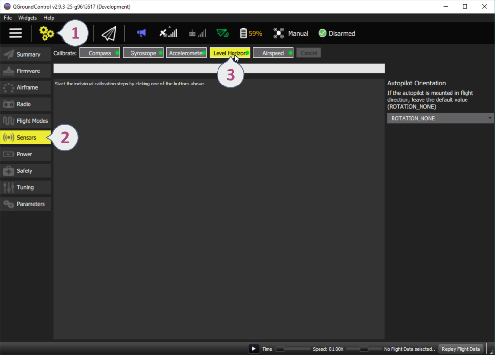
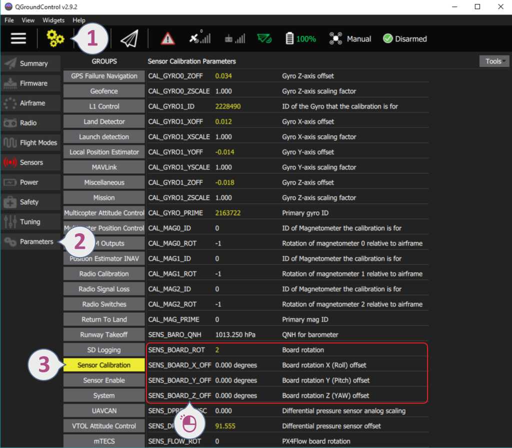

# Flight Controller Orientation

## Heading and Flight Controller Orientation

By default the heading mark should be oriented front, as shown below.

This default placement applies to all aircraft frames – airplane,
multirotor and VTOL as well as to all ground vehicles.

Sometimes however it is necessary to mount the board in a different
orientation, for example: upside down or on one side or even
perpendicular to the heading direction. Here are some examples for
different YAW positions.

The default position is the “Zero point” for all three axes **X,Y,Z**. 
To calculate the proper Yaw
angle offset from our example we start counting from the default
position and increase the YAW angle CW (clock wise), with rotation
along the **Z** axis. The same rule
applies to the Pitch and Roll offset angles rotated respectively
along the **Y** and **X** axis.

The appropriate offset angles should be preset in the prior to flight,
during the setup process (If you don’t know how to make a connection
read “Connection PX4 to QGroundControl”).

## Setting the Coarse Orientation

The recommended option is to set the orientation during the calibration
process in QGroundControl Settings in three easy steps.

After this is set, check in the flight view that the horizon is level
(blue on top and green on bottom) and that the heading in the compass
shows a value around 0 when you point the vehicle towards north.

## Fine Tuning with Level Horizon Calibration

For best flight performance the horizon has to be leveled. This is done
by placing the copter / plane in its level flight orientation (planes
tend to have their wings slightly pitched up!) on a level surface (floor
or table) and clicking the "Level Horizon" button. This step makes a
significant difference for accurate level flight. Here is how you do it.

Place the aircraft in its level flight position ( how it is supposed to
stay in the air during level flight for the planes and hover position
for the copters ) on a leveled surface.

Confirm the calibration

Wait until the calibration process is finished.

In the case of error or if you notice a constant drift during flight
just repeat again the Level Horizon Calibration.

 

## Advanced Users

> **Note** These instructions are not recommended for regular users. 
  For basic settings stick to the instructions above.

The expert option is to change the following parameters in
QGroundControl.

 

## Sensor calibration parameters

**SENS_BOARD_ROT**

This parameter defines the rotation of the FMU board relative to the
platform. Possible values are:

- 0 = No rotation
- 1 = Yaw 45°
- 2 = Yaw 90°
- 3 = Yaw 135°
- 4 = Yaw 180°
- 5 = Yaw 225°
- 6 = Yaw 270°
- 7 = Yaw 315°
- 8 = Roll 180°
- 9 = Roll 180°, Yaw 45°
- 10 = Roll 180°, Yaw 90°
- 11 = Roll 180°, Yaw 135°
- 12 = Pitch 180°
- 13 = Roll 180°, Yaw 225°
- 14 = Roll 180°, Yaw 270°
- 15 = Roll 180°, Yaw 315°
- 16 = Roll 90°
- 17 = Roll 90°, Yaw 45°
- 18 = Roll 90°, Yaw 90°
- 19 = Roll 90°, Yaw 135°
- 20 = Roll 270°
- 21 = Roll 270°, Yaw 45°
- 22 = Roll 270°, Yaw 90°
- 23 = Roll 270°, Yaw 135°
- 24 = Pitch 90°
- 25 = Pitch 270°

## Fine tuning

> **Success** Set the plane/copter in level flight
  orientation on the ground or a table and click the "Level Horizon"
  button in the sensor calibration window to fine-tune the rotation
  offset.

The orientation may also be fine-tuned manually with parameters to
correct for sensor board small misalignment or minor calibration errors.
If there is a persistent drift bias (often seen in multirotors but not
limited to them), it is a good strategy to trim it with the help of this
fine-tuning offset angle parameters instead of using the trimmers of
your RC Transmitter. This way when in fully autonomous flight the
aircraft will maintain the trimming. The X,Y and Z fine tuning offsets
are fixed relative to the board itself not to its orientation in the
frame. This way the fine tuning angles used in this parameters are added
to the SENS_BOARD_ROT angle in order to get the total offset angles
for the Yaw, Pitch and Roll orientation of the flight controller.

> **Success**  The two rotations are applied consecutively
  (SENS_BOARD_ROT and SENS_BOARD_XYZ_OFF). The values here therefore
  define a rotation by a delta defined in the NED frame. 

**SENS_BOARD_X_OFF**

Rotation, in degrees, around PX4FMU's X axis or Roll axis. Positive
angles increase in CCW direction, negative angles increase in CW
direction.

**SENS_BOARD_Y_OFF**

Rotation, in degrees, around PX4FMU's Y axis or Pitch axis. Positive
angles increase in CCW direction, negative angles increase in CW
direction.

**SENS_BOARD_Z_OFF**

Rotation, in degrees, around PX4FMU's Z axis Yaw axis. Positive angles
increase in CCW direction, negative angles increase in CW direction.
