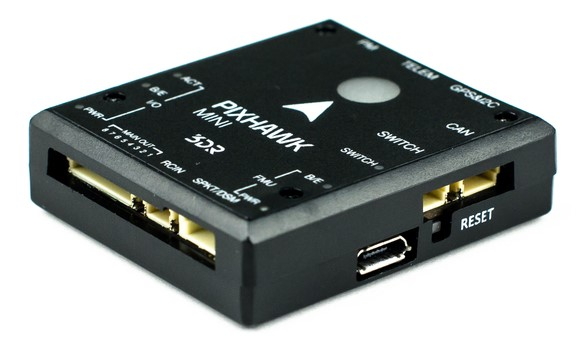
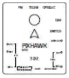

# Pixhawk Mini Overview

> **Warning** Under construction. Requires connection diagrams and more images of ports

The 3DR *Pixhawk Mini* autopilot is a next-generation evolution of the
Pixhawk (designed by 3DR in collaboration with HobbyKing). It is about
1/3rd the size of the original Pixhawk and has more powerful processors
and sensors.

The Pixhawk Mini is based on the PX4 open-hardware project and has been
optimized for the PX4 flight stack.

The flight controller (autopilot) can be purchased from the [3DR
Store](https://store.3dr.com/products/3dr-pixhawk). Wiring information is available in the [Quick Start](pixhawk_mini_wiring_quick_start.md).

## Specifications

**Processors:**

- **Main Processor​:** STM32F427 Rev 3
- **IO Processor​:** STM32F103

**Sensors:**

- **Accel/Gyro/Mag:** MPU9250
- **Accel/Gyro:** ICM20608
- **Barometer:** MS5611

**Voltage ratings:**

- **Power module output:** 4.1\~5.5V
- **Max input voltage:** 45V (10S LiPo)
- **Max current sensing:** 90A
- **USB Power Input:** 4.1\`5.5V
- **Servo Rail Input:** 0\~10V

**Interfaces​:**

- 1 x UART Serial Port (for GPS)
- Spektrum DSM/DSM2/DSM-X® Satellite Compatible RC input
- Futaba S BUS® Compatible RC input
- PPM Sum Signal RC Input
- I2C (for digital sensors)
- CAN (for digital motor control with compatible controllers)
- ADC (for analog sensors)
- Micro USB Port

**Weight and dimensions:**

- **Dimensions:​** 38x43x12mm
- **Weight:** 15.8g

**GPS module (supplied with kit)​:**

- **GNSS receiver:** ublox Neo-M8N; compass HMC5983
- **Weight:**​ 22.4g
- **Dimensions:** 37x37x12mm

## Connector assignments

\<To be added.\>

## Features

Key features of the Pixhawk Mini are:

- Advanced 32 bit ARM Cortex® M4 Processor running NuttX RTOS
- 8 PWM/servo outputs
- Multiple connectivity options for additional peripherals (UART,  I^2^C, CAN)
- Redundant power supply inputs and automatic failover
- Integrated safety switch and optional external safety button for
  easy motor activation
- Multicolor LED indicator
- Integrated multi-tone piezo audio indicator
- microSD card for long-time high-rate logging
- Easy-to-use Micro JST connectors

The Pixhawk Mini is shipped with new **GPS module**:

- Based on the uBlox M8N
- Concurrent reception of up to 3 GNSS (GPS, Galileo, GLONASS, BeiDou)
- Industry leading –167 dBm navigation sensitivity
- Security and integrity protection
- Supports all satellite augmentation systems
- Advanced jamming and spoofing detection
- Product variants to meet performance and cost requirements

## Kit package

The 3DR *Pixhawk Mini* is shipped with the following contents:

Component | Image
--- | --- 
Pixhawk Mini Autopilot | 
GPS module             |  
Quad Power Distribution Board        |   
8 Channel PWM Breakout board         |   
4-pin cable (for I2C)                |  
RC-in cable for PPM/SBUS             |  
6 to 6/4 ‘Y’ adapter for GPS and additional I2C devices    |  
6 pin cable (2)    (for power distribution board and for compass/gps)                   |  
6 pin JST to DF13 for legacy telemetry radio      | 
Safety switch                        |  
I2C breakout board ? - not listed  parts on handout |  -                                   
 

## Optional accessories

- Telemetry Radio Sets

  - [915 MHz (USA)](https://store.3dr.com/products/915-mhz-telemetry-radio)
  - [433 MHz (European)](https://store.3dr.com/products/433-mhz-telemetry-radio)
  
  > **Note** When installing the 3DR telemetry radios, use the
  connectors that come with Pixhawk Mini, rather than those that
  come with the radios.

- [10S Power Module](https://store.3dr.com/products/10s-power-module)
- [WiFi Telemetry Radio](https://store.3dr.com/products/wifi-telemetry-radio)
- [Digital Airspeed Sensor](https://store.3dr.com/products/digital-airspeed-sensor)

## Compatibility

### RC radio

- PPM output RC receivers
- Spektrum DSM RC receivers
- Futaba S BUS RC receivers

### ESCs

- All standard PWM input ESC’s

## Connector pin assignments (pin outs)

## Product comparisons

### Pixhawk Mini vs Pixhawk (original)

- One-third the size - from 50x81.5x15.5mm to 38x43x12mm.
- Rev 3 processor for full utilization of 2MB flash memory.
- Improved sensors, both primary and secondary IMU MPU9250 and
  ICM20608 respectively. The result is more stable, more reliable
  flight and navigation.
- GPS+Compass module included. Features the Neo M8N with GLONASS
  support; compass HMC5983. Expect faster and stronger GPS lock.
- Micro JST connectors instead of DF-13. These are much easier to work
  with.
- Integrated piezo speaker and safety switch.
- Natively supports 4S batteries with the included PDB.

### Pixhawk Mini vs Pixfalcon

- Improved sensors, both primary and secondary IMU MPU9250 and
  ICM20608 respectively. Expect better vibration handling and
  reliability.
- CAN interface for UAVCAN support.
- Includes 8-channel breakout servo rail for planes and other vehicles
  requiring powered PWM output.
- Includes I2C breakout board for a total of 5 I2C connections.
- Similar size.

Pixhawk Mini features an advanced processor and sensor technology from
ST Microelectronics® and a NuttX real-time operating system, delivering
excellent performance, flexibility, and reliability for controlling any
autonomous vehicle.

## More information

The following links include additional information:

- [FAQ - Pixhawk Mini (3DR)](https://3drobotics.zendesk.com/hc/en-us/articles/206921450-Pixhawk-Mini-FAQ)
- [Pixhawk Mini Quick Start Guide (3DR)](https://3drobotics.zendesk.com/hc/en-us/article_attachments/115000349564/PixhawkMiniQuickStartGuide.pdf)
- [Pixhawk Mini Announcement Blog (Diydrones)](http://diydrones.com/profiles/blogs/new-3dr-autopilot-pixhawk-mini-2)
- [Buy here (3DR Store)](https://store.3dr.com/products/3dr-pixhawk)
- [Wiring Quick Start](pixhawk_mini_wiring_quick_start.md)

