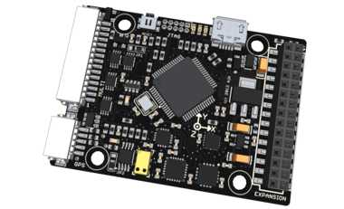
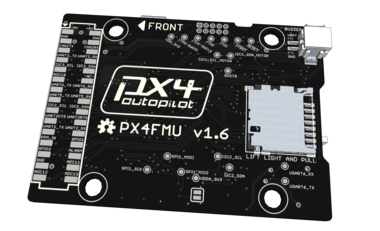
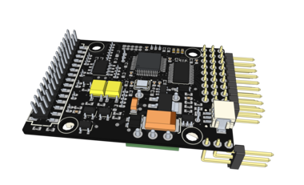
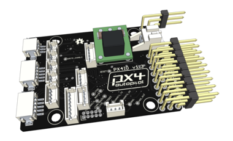
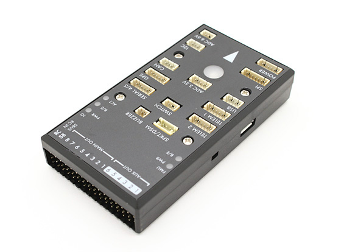
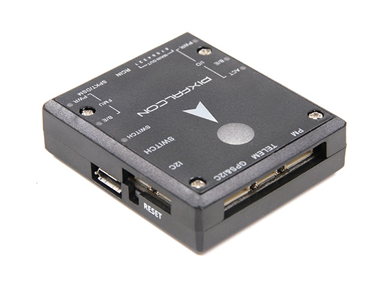
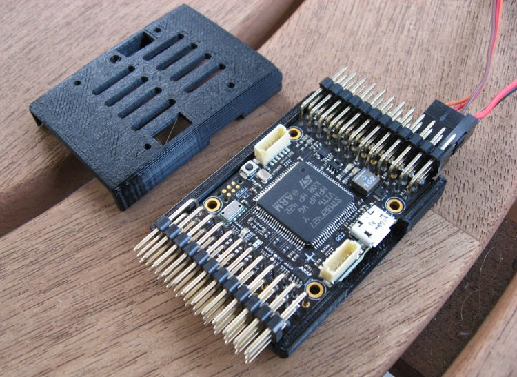
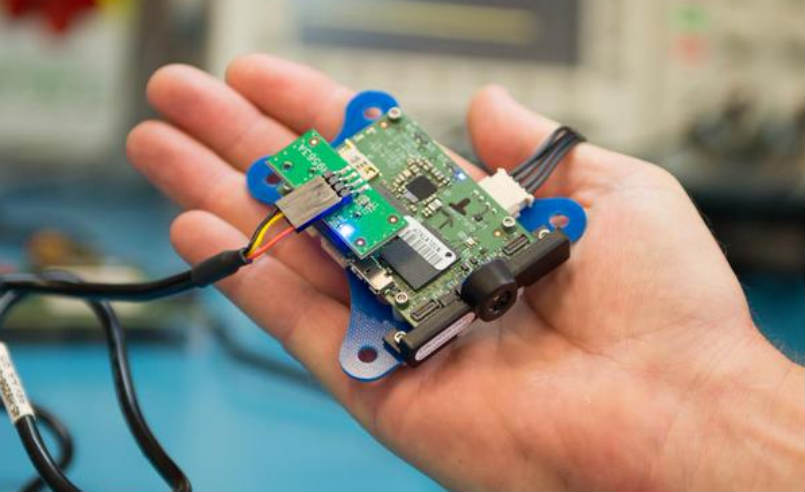

# Flight Controller Selection

### Pixhawk Flight Controller

#### First Generation Pixhawk

Pixhawk is the first flight controller created specifically to be loaded
with PX4 autopilot software (PX4 flight stack). The first architecture
created was named Pixhawk v1 which had a two components PX4FMU+PX4IO.
Sometimes this architecture is called FMUv1.

- PX4FMU

  
  

- PX4IO

  
  

  
#### Second Generation Pixhawk

After the success of FMUv1 there was a second architecture created named
Pixhawk v2 or sometimes called FMUv2. This architecture combines the
PX4FMU and PX4IO in one hardware controller.

- Pixhawk v2

  

This is the most popular Pixhawk architecture so far.

#### Third Generation Pixhawk

Just recently a third generation of architecture was released,
referred as FMUv4 and PixRacer is the first board with this
architecture. There is Pixhawk v3 in the making so soon it will be
available on the market.

- PixRacer v1

  

### Open Hardware Concept

Pixhawk is an Open Hardware architecture so there are many producers of
Pixhawk controller with a different brand names released by different
companies around the world. They share a common architecture and have
the same connections, outputs, functions but in a different form
factors. Here are some Pixhawk controllers available.

- HKPilot32

  

- Pixfalcon

  

- AUAV-X2

  

All Pixhawk flight controllers share the same connections and setup
process explained in this Users Manual. If there are specific
differences in the wiring we will explain it in detail further on.

> **Note** In addition to PX4 autopilot, there is a
second Flight Stack that can be loaded on to the Pixhawk FC. It is the
popular ArduPilot Flight Stack or APM. Thus many people get confused and
identify Pixhawk with APM which is wrong. Remember Pixhawk is HARDWARE,
while PX4 and APM are Open Source Autopilot Software or Flight Stacks. 

### Snapdragon Flight Controller

There are numerous tasks that people need to perform with their aircraft
while in flight - like image analysis, obstacle avoidance as well as
many on-line services and system integration. Until Snapdragon Flight
the path was to use a microcomputer like Raspberry Pi alongside the
Flight Controller. All this integration is sometimes cumbersome and hard
to achieve by the regular user.

Qualcomm company solves this problem and combines a true micro computer
with a flight controller in one board. Snapdragon Flight is able to
be loaded with PX4 flight stack, fly your aircraft and perform all the
additional tasks needed. It features Quad Core CPU, a fully functional
GPU and many cameras and sensors. It will be able to perform many
additional tasks as a fully featured micro PC along flying the aircraft
with PX4.
